As a designer, I’ve always dreamt of having a website portfolio—a place where I could experiment, make mistakes, and learn in the process. But the task overwhelmed me. 

After many years of working in web design, I learned the key to a good website: you must to be able to modify it. You and your work are always evolving. Your website should embrace that.

Now I know how to build a website that grows with me. I want to share what I learned with you. I’m writing this guide for my designer friends who don’t know where to start. However, I will cover all the basics of web development. And even if you are not a designer, you will be able to create a website that fits your needs.

This is the guide I wish I had when I started building my website.  
I hope it inspires you to build yours.

Good luck!

---

## 1. Goals

Define your goals, then narrow them down. Don’t aim for a perfect website from the start. Instead, design a simple website that you can improve over time. You can always add new sections to it.

A first version only needs:

- An About page
- Your email
- Link to your portfolio (if you have one)

It sounds like too little, but this is a good start. You will be surprised by how hard it is to write a good About section or select what work to show. My first website had only that, and it was enough to get clients as a freelancer.

Open Figma (or whatever design tool you use), and come up with a basic layout. For this guide, we’re going to use this design:

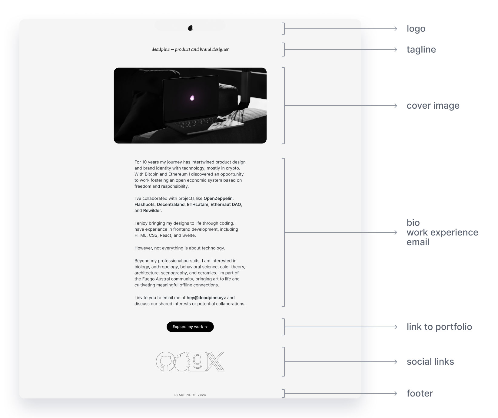


## 2. Basics of Web Development

The visual and interactive experience you perceive as a website is just a text document behind the scenes. So, to build a website, you need to write text—or, more specifically, code. **Code** is a set of instructions written in a language (_text_) that a computer can understand (_read_) and execute (_follow instructions_). There is no magic. Just text.

You can write code using any text editor. But it’s better to use one designed for writing code. It will show different colors for different elements of your code, auto-complete parts, and highlight errors. I use and recommend Visual Studio Code.

**🔜 [Download Visual Studio Code now](https://code.visualstudio.com/)**

There are many languages that a computer can understand and execute. The language of the web is called **HTML**. As with any other language, there are rules that you must follow. (In English we call it grammar). For example, if the English I don’t rules follow, understand humans not.

Basic HTML code looks like this:

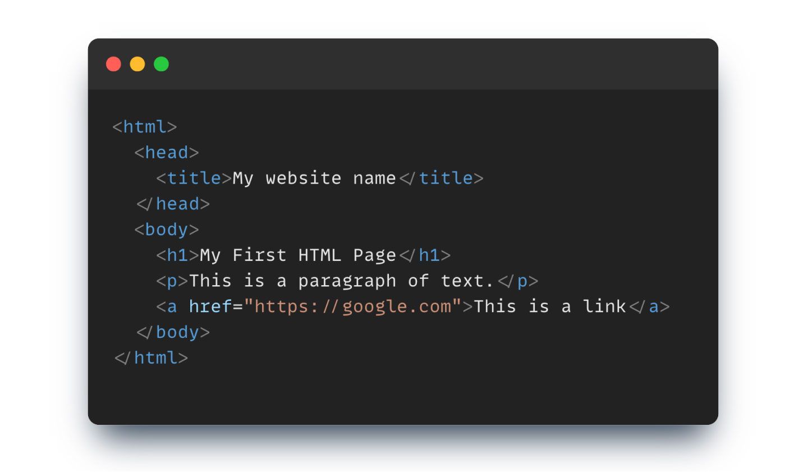

Look again.

Do you see a pattern? There are blue words enclosed in  **<...>** that appear again inside **</...>**. These are **HTML tags**, and they are the core of the language. For example, find the tag starting with `<head>` and ending in `</head>`.

HTML tags tell the computer what type of element you want to use, where it starts, where it ends, and what’s inside. Notice that you can _nest_ tags to create more complex elements.

The basic structure of an HTML tag looks like this:

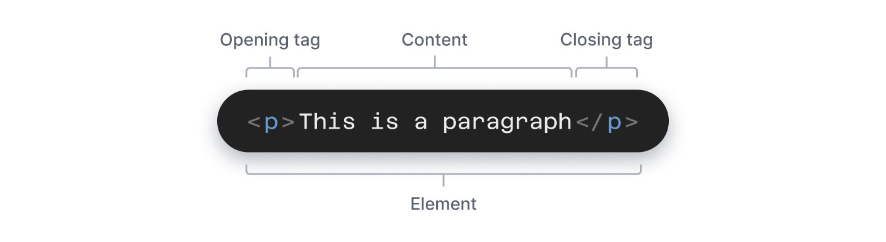

Let’s see the meaning of the ones I used in the example:

**Basic HTML tags:**

- `<html> … </html>`
    This indicates the beginning and end of the HTML document.  
    All your other tags must be inside it.
- `<head> … </head>`
    This contains meta-data about your website (e.g. title, styles, fonts, etc.).
- `<title> … </title>`
    This is the title of your website.  
    It will appear on the browser tab and in search engine results.
- `<body> … </body>` 
    This contains everything you see on a website, like text, images, and links.

**Basic content tags (they go inside the `<body>` tag):**

- `<h1> … </h1> (heading 1)`
    This is the main heading of the page.  
    There are other headings with different sizes from `<h1>` to `<h6>`.
- `<p> … </p> (paragraph)` 
    This is used for blocks of text.
- `<a> … </a> (anchor)`
    This is used for links to another page, website, or resource.  
    The text you put between the tags is the text displayed on the link.  
    However, how do we specify _where_ the link points to?

We need an **HTML attribute**. Attributes tell the browser additional instructions about the tag. In this case, we’ll use `href=”…”` to add a website URL:


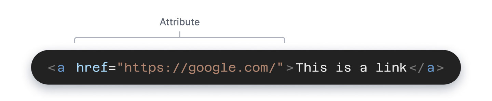


These are the most common HTML tags. I’ll be introducing more as we need them.  

## 3. Writing your code

Let’s start:

1. Create a new folder
2. Open VS code
3. Click on “Open” and select your new folder
4. Click on “New file”
5. Click “Save” and name it **index.html**
6. Copy and paste this code:

```
<html>
  <head> 
    <title>My website name</title> 
  </head> 
  <body> 
    <h1>My First HTML Page</h1> 
    <p>This is a paragraph of text.</p> 
    <a href="https://google.com">This is a link</a> 
  </body> 
</html>
```

7. Save it again
8. Open a new tab in your web browser (Chrome, Safari, etc).
9. Go to File → Open → and find index.html in your folder.

This is how it should look on VS code and in your browser:

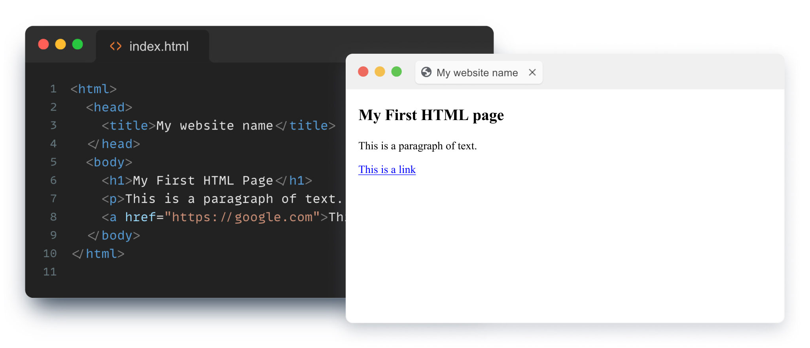

Now that you have a basic structure, add your content.

When you make edits, remember to save the file and refresh your browser tab to see the changes. Try changing the content inside the `<title>` tag. If the name on your browser tab updates, you’ve done it right!

Congratulations, you just created your first website using HTML 🎉

## 4. Implementing your design

Let’s look back at the design I prepared:

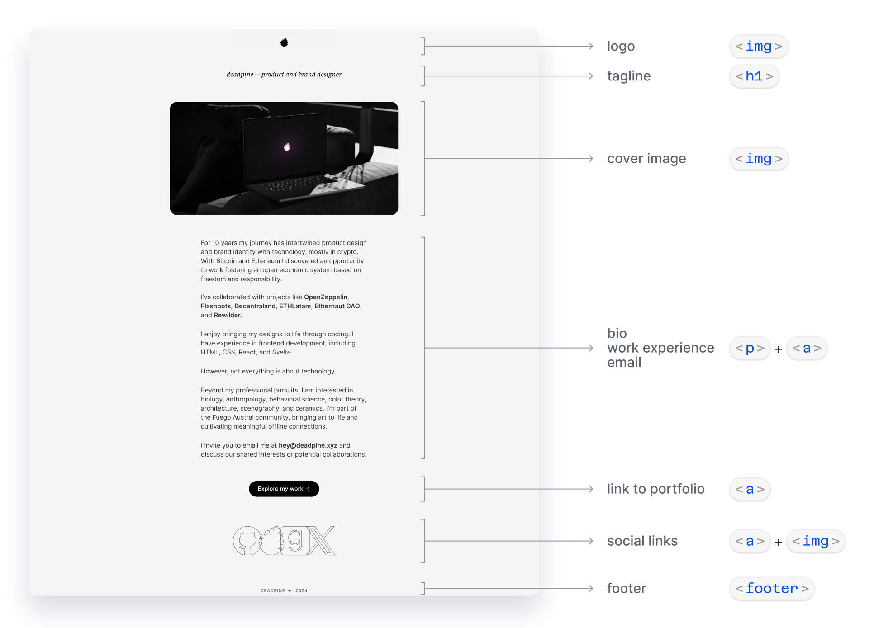


You can see the HTML tags we’ll use for each section. We will slowly transform the basic index.html you have into your personal website.

### 📝 Text

First, update the `<h1>`. Write your name and position (e.g.: deadpine — product and brand designer).

```
<h1>deadpine — product and brand designer</h1>
```

Then continue with your bio and work experience. Don’t worry too much about what you write. Just tell your story in 3 short sentences. Remember, you can change this easily later. Create a new `<p>` tag for each paragraph.

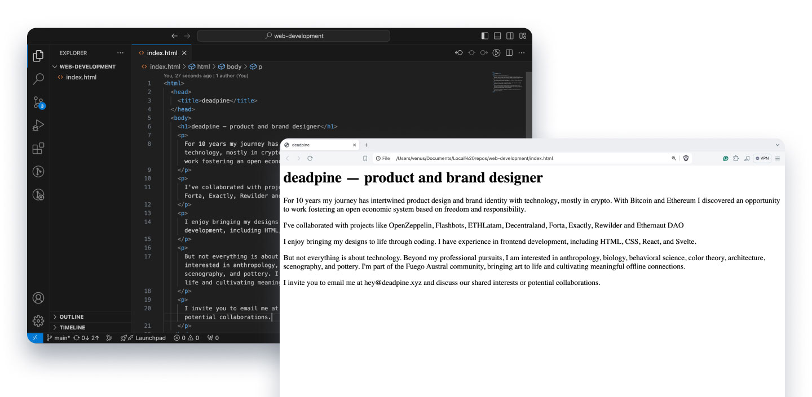

### 🔗 Links

Next, add links to your text:

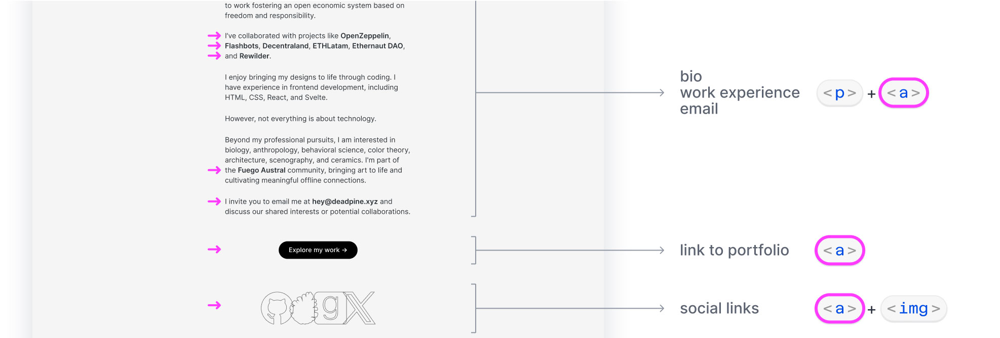

Start creating `<a>` tags with links to your clients’ websites. You can add a new attribute to your links: **target="_blank"**. This tells the browser to open the links in a new tab.

Here is an `<a>` element you can copy and paste:

```
<a href="https://deadpine_xyz" target="_blank">Deadpine’s website</a>
```

Once you add your links, test them in the browser to see if they take you to the websites you want them to.

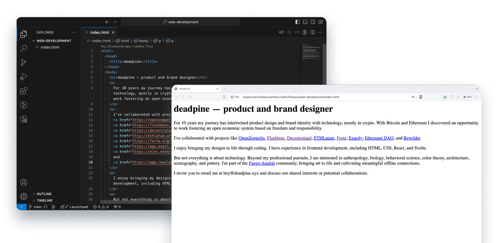

For your email, use a variation of the attribute **href="…”** by adding **mailto:.** This tells the browser to open the user’s email application and create a new draft with your email as the recipient.

```
<a href="mailto:hey@deadpine.xyz">Email me</a>
```

Finally, create links to your portfolio and social sites.

### 🌅 Images

Continue with your images (e.g. your logo and cover image). Create a new folder called “**img**” and add your images there. If you want to use icons for your social links, add them here too. VS Code will display the new folder and images in the left column.

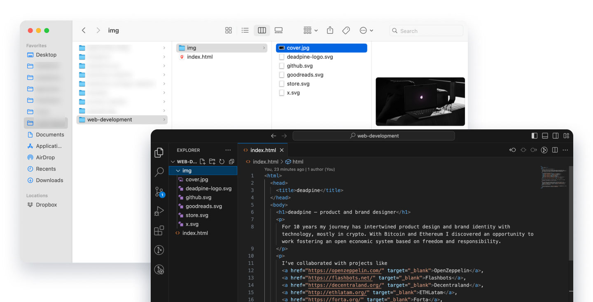

Next, create the image tags: ``. These are slightly different from the tags you used so far. They are **self-closing tags**. They start with `<` and end with `/>`. You don’t need to add an extra closing `</img>` tag at the end.

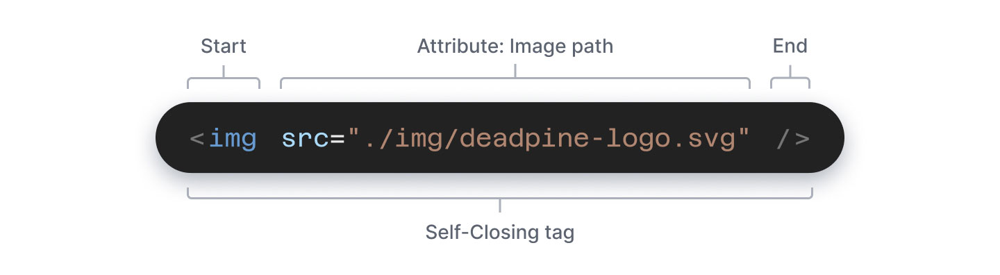

`` tags requires the attribute `src=”...”` (**s**ou**rc**e). This tells the browser how to find the image in your files. This location is called **image path**.

Because your browser can only see files inside the same folder as your index.html, you need to specify a relative file path. Use a dot `.` as the start of the path, which symbolizes the folder that contains index.html.

VS Code will autocomplete the image path:

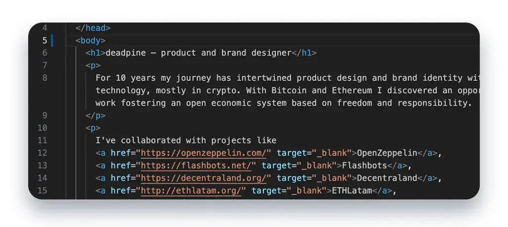

Here is an  tag you can copy and paste

```

```

Add one `` tag for each image, and position it where you want the image to appear in the document. This is how your page should look with the images:

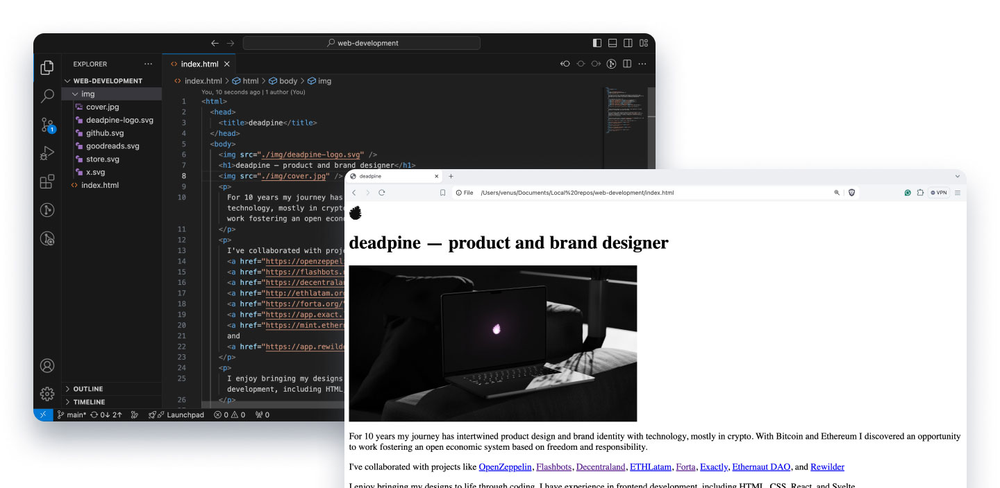

If your image looks too big, you can adjust its size by adding a new attribute: **width="480"**. This will set the maximum width of your image to 480 pixels.

```

```

### 🦶Footer

The last step will be adding your name and current year at the bottom of your website. This information is usually contained inside a `<footer>` tag. Remember to add it inside your `<body>` element. Here is an example:

```
<footer>deadpine ✦ 2024</footer>
```

---

You just finished the first version of your website! Time to celebrate 🥳🎊

Next… the fun part: ✨ **adding the styles** ✨. I’ll explain this in the following guide. Subscribe if you would like to receive an email when I publish it.

Thanks for reading!

Subscribed

---

#### Appendix

Some things and links that you might like:

- The [complete code](https://github.com/deadpine/web-development/blob/main/index.html) that we wrote today.
- A [guide by Mozilla](https://developer.mozilla.org/en-US/docs/Learn/Getting_started_with_the_web/HTML_basics) that goes deeper into HTML tags
- VS code shortcuts I use all the time:
    - Cmd + N: New File.
    - Cmd + S: Save.
    - Cmd + Left-Arrow: Go to the beginning of the current line.
    - Cmd + Right-Arrow: Go to the end of the current line.
    - Cmd + D: [Select the next word that matches the one you have selected.](https://www.youtube.com/watch?v=JMLreTrXnvs)
